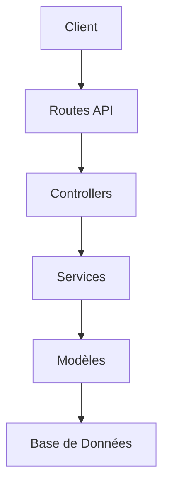

## Résumé des Modifications Backend

Ce document résume les modifications apportées au backend de l'application e-commerce, conformément aux spécifications définies dans `Cahier-charge.md`.

## Architecture Globale

### Schéma Technique


### Modèles (`app/Models`)

- **Product:**
  - Ajout du champ `actif` (booléen) pour gérer la visibilité des produits côté client.
  - Mise à jour des champs pour correspondre aux spécifications (ex: `nom`, `description`, `prix`, `image`).
- **Order:**
  - Mise à jour du champ `statut` avec les valeurs autorisées : `en attente`, `confirmée`, `livrée`.
  - Suppression de la relation directe avec `User` (si applicable, l'association peut se faire via d'autres moyens si nécessaire).
  - Ajout/Mise à jour des champs comme `nom_client`, `email_client`, `adresse_livraison`, `produits` (probablement JSON ou relation ManyToMany via une table pivot).

## Migrations (`database/migrations`)

- Création ou modification des migrations pour refléter les changements dans les modèles `Product` et `Order`.
  - Ajout de la colonne `actif` à la table `products`.
  - Modification de la colonne `statut` dans la table `orders`.
  - Ajout des colonnes `nom_client`, `email_client`, `adresse_livraison`, `produits` à la table `orders`.

## Routes API (`routes/api.php`)

- **Routes Publiques (`/api/`):**
  - `/products`: Liste les produits actifs (`ProductController@index`).
  - `/products/{product}`: Affiche un produit spécifique s'il est actif (`ProductController@show`).
  - `/orders`: Permet de créer une nouvelle commande (`OrderController@store`).
- **Routes Admin (`/api/admin/` - nécessitent authentification/autorisation):
  - `/admin/products`: CRUD complet pour les produits (`Admin\ProductController`).
  - `/admin/orders`: Liste, affiche, met à jour (statut) et supprime les commandes (`Admin\OrderController`).

## Contrôleurs (`app/Http/Controllers`)

- **API (`Api/`):**
  - `ProductController`: Logique pour lister et afficher les produits actifs.
  - Correction de la duplication de la méthode login()
  - `OrderController`: Logique pour enregistrer les nouvelles commandes des clients.
- **Admin (`Admin/`):**
  - `ProductController`: Implémentation des opérations CRUD pour la gestion des produits par l'administrateur, incluant la validation.
  - `OrderController`: Implémentation de la gestion des commandes par l'administrateur (lister, voir détails, changer statut, supprimer), avec validation pour la mise à jour du statut.

## Authentification Admin via Sanctum
- Implémentation d'un système d'authentification sécurisé pour l'administration
- Génération de tokens d'accès avec scopes 'admin'
- Protection des routes admin avec middleware Sanctum et abilities

## Structure de Commande
- Relation ManyToMany entre Order et Product via une table pivot `order_items`
- Champ calculé `total` utilisant une relation avec sommation des prix
- Gestion des stocks via décrémentation lors de la confirmation de commande

## Intégration WhatsApp

**Flux de notification** :
```php
// OrderController.php
if ($order->wasChanged('status')) {
    $whatsappService->sendOrderReport(
        $order->phone_number,
        "Votre commande #{$order->id} a été mise à jour"
    );
}
```

**Variables d'environnement requises** :
```env
WHATSAPP_API_KEY=votre_cle_api
WHATSAPP_PHONE_NUMBER=+221XXX
WHATSAPP_TEMPLATE_ID=status_update
```

**Journalisation des erreurs** :
```php
\Log::error('Échec envoi WhatsApp : ' . $e->getMessage());
```

## Validation des Données
- Validateurs customisés pour les opérations CRUD admin
- Messages d'erreur localisés en français
- Validation asynchrone pour les champs uniques

## Soft Deletes
- Mise en place du soft deleting sur les modèles Product et Order
- Archivage des données plutôt que suppression définitive
- Restauration possible via routes admin dédiées

Ces modifications visent à aligner le backend avec les exigences fonctionnelles spécifiées, en séparant clairement les fonctionnalités accessibles au public de celles réservées à l'administration.